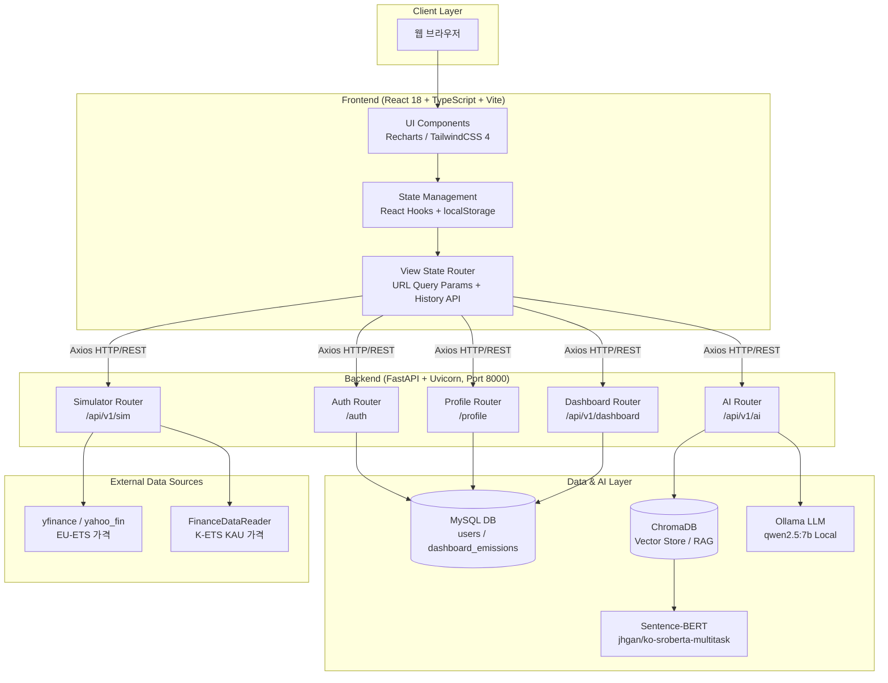

# 🌿 ESG Carbon Dashboard (Carbon Strategic OS)

> **AI 기반 탄소 배출 관리 및 전략적 의사결정 지원 플랫폼**

---

## 📖 1. 프로젝트 개요 (Project Overview)

**ESG Carbon Dashboard**는 기업의 환경적 책임(Environmental)을 데이터 중심의 전략적 자산으로 전환하기 위해 개발된 **Carbon Strategic OS**입니다.

단순히 과거의 배출량을 기록하는 데 그치지 않고, 다음과 같은 핵심 가치를 제공합니다:

- **실시간 트래킹**: 글로벌 탄소 시장(EU-ETS, K-ETS)과 에너지 가격(WTI)을 연동한 실시간 리스크 분석.
- **경쟁사 벤치마킹**: 탄소 집약도(Carbon Intensity) 기준 동종 업계 내 순위 및 격차 시각화.
- **K-ETS 시뮬레이터**: 순 배출 노출량(Net Exposure) 계산 및 3가지 최적 조달 전략 자동 생성.
- **목표 기반 의사결정**: SBTi 기반 감축 경로와 목표 달성 확률(Monte Carlo)을 정량적으로 제시하여 실행 우선순위 결정 지원.
- **지식 증강 질의응답**: RAG(Retrieval-Augmented Generation) 기술을 통해 비정형 ESG 보고서에서 즉각적인 전략 인사이트를 추출.

이 프로젝트는 개발자뿐만 아니라 ESG 실무자, CFO, 그리고 지속 가능성 전략가가 실무에서 즉시 활용할 수 있는 수준의 **전문 기술 도구**를 목표로 합니다.

---

## 📑 2. 목차 (Table of Contents)

1. [시스템 아키텍처](#-3-시스템-아키텍처-system-architecture)
2. [핵심 기능 및 설계 의도](#-4-핵심-기능-및-설계-의도-core-features)
   - [Dashboard: 배출량 통합 대시보드](#41-dashboard-tab-배출량-통합-대시보드)
   - [Compare: 경쟁사 비교 분석](#42-compare-tab-경쟁사-비교-분석)
   - [Simulator: K-ETS 준수 비용 시뮬레이터](#43-simulator-tab-k-ets-준수-비용-시뮬레이터)
   - [Target: SBTi 목표 관리](#44-target-tab-sbti-목표-관리)
   - [ChatBot: AI 전략 에이전트](#45-chatbot-ai-전략-에이전트)
   - [인증 시스템](#46-인증-시스템-authentication)
   - [프로필 설정](#47-프로필-설정-profile-settings)
3. [기술 스택 및 모듈 연동](#️-5-기술-스택-및-모듈-연동-tech-stack--implementation)
4. [프로젝트 구조](#-6-프로젝트-구조-project-structure)
5. [페이지 라우팅 구조](#️-7-페이지-라우팅-구조-page-routing)
6. [설치 및 설정](#️-8-설치-및-설정-installation--setup)
7. [API 명세](#-9-api-명세-api-specification)
8. [AI 모델 평가](#-10-ai-모델-평가-ai-model-evaluation)

---

## 📐 3. 시스템 아키텍처 (System Architecture)

### 3.1 전체 파이프라인



---

## 🚀 4. 핵심 기능 및 설계 의도 (Core Features)

### 4.1 Dashboard Tab (배출량 통합 대시보드)


- **역할(Role)**: 기업의 Scope 1, 2, 3 배출 현황 및 재무 리스크 지표를 한눈에 시각화.
- **의도(Purpose)**:
  - **즉각적인 현황 파악**: 경영진이 4개의 KPI 카드(총 탄소 배출량, 탄소 집약도, 배출권 거래 단가, SBTi 달성 확률)를 빠르게 파악하도록 설계.
  - **Scope별 배출 기여도**: Scope별 배출량 수치와 비중(%)을 시각화.
  - **궤적 시각화**: 2021년부터의 실제 배출량 추이와 회귀 예측값을 Scope별로 파악할 수 있도록 시각화.
  - **바로가기 카드**: KPI 카드 클릭 시 관련 탭(경쟁사 비교, 시뮬레이터, 목표 관리)으로 즉시 이동.
- **KPI 카드 구성**:
  1. **총 배출량** (Scope 1+2): tCO₂e
  2. **탄소 집약도**: 해당 기업의 탄소 집약도(tCO₂e / 매출 1억원) 또는 에너지 집약도(TJ/억원)로 전환 가능
  3. **K-ETS**: 실시간 한국 배출권 거래 단가
  4. **SBTi 달성 확률**: SBTi 국제 표준 기준으로 Monte Carlo 시뮬레이션 결과 (%) 감축 달성 확률을 표기

---

### 4.2 Compare Tab (경쟁사 비교 분석)


- **역할(Role)**: 동일 업종 기업의 탄소/에너지 집약도를 정렬하여 상대 포지션을 빠르게 파악.
- **핵심 동작**:
  - 집약도 모드 전환: `revenue`(탄소 집약도), `energy`(에너지 집약도)
  - Scope 토글: S1/S2 반영 여부를 즉시 차트 계산에 반영
  - 기준선 자동 계산: 상위 10% 및 중앙값 임계선 오버레이
  - 카드 선택 연동: 선택 기업 강조 + 인사이트 내용 동기화
  - 실행 연계: `세부 실행 계획` 버튼으로 Simulator 탭 이동
- **기술 요소**:
  - `CompareTab.tsx`: Recharts `BarChart`, `ReferenceLine`, 동적 색상 셀 렌더링
  - 백엔드 연계: `POST /api/v1/dashboard/compare/insight`로 AI 인사이트 생성
  - 네비게이션: `navigateTo('dashboard', 'simulator')`

---

### 4.3 Simulator Tab (K-ETS 준수 비용 시뮬레이터)


- **역할(Role)**: 탄소 가격·배출량·할당량 변화에 따른 준수비용을 시뮬레이션하고 매수/감축 전략을 비교.
- **핵심 동작**:
  - 시장 데이터: EU-ETS/K-ETS 이력(`1m`, `3m`, `1y`, `all`) 조회
  - 노출량 계산: 배출량, 할당 변화, 감축 옵션 적용 후 `Net Exposure` 산출
  - 시나리오 입력: 가격 시나리오(`base/custom`), 할당 변화, 배출 변화(%)
  - 전략 비교: 조달/감축 조합별 총비용 및 영향도 비교
  - 트랜치 구성: K-ETS/EU-ETS 분할 매수 비율로 포트폴리오 테스트
- **기술 요소**:
  - 프론트: `SimulatorTab.tsx`, 상태 기반 즉시 재계산
  - 백엔드: `GET /api/v1/sim/dashboard/market-trends`, `GET /api/v1/sim/dashboard/trend-combined`
  - 데이터 소스: `market_data.py`에서 `yfinance + FinanceDataReader` 다중 fallback

---

### 4.4 Target Tab (SBTi 목표 관리)


- **역할(Role)**: SBTi 기준연도(2021) 대비 감축 경로와 현재 실적 간 격차를 시각화하고 2030/2050 목표 달성 가능성을 정량화.
- **의도(Purpose)**:
  - **목표 정렬**: 기준 배출량(2021), 현재(최신) 배출량, SBTi 목표 달성 여부를 한 화면에서 확인.
  - **확률 기반 판단**: 로그 회귀 Monte Carlo(10,000회) 기반 2030 목표 달성 확률 제공.
  - **Net Zero 2050 추적**: 현재 감축률과 2050 목표(90%+ 감축) 간 격차 실시간 표시.
  - **정확한 목표달성도 판정**: 현재 연도(2026)가 아닌 최신 데이터 연도(`latestDataYear`, 최신 발간된 ESG보고서에서의 연도 기준이며 현재는 2024년)로 설정하여 동일 연도 기준으로 정확히 판정.
- **KPI 카드 구성**:
  1. **기준 배출량 (2021)**: tCO₂e
  2. **최신 배출량**: tCO₂e + 2021년 대비 % 감축
  3. **SBTi 달성 여부**: 목표 대비 격차를 판단하여 명시
  4. **Net Zero 2050**: 필요 총 감축량(90%+), 현재 달성(%), 잔여 격차(%)
  5. 
- **예측 방법론**:

  ```
  모델: log(E_t) = α + β*t  (로그-선형 OLS 회귀)
  감축 목표: 연간 4.2% (SBTi 절대 감축 기준)
  Monte Carlo: 10,000회 샘플링 → 2030 달성 확률 계산
  ```

- **기술 요소**: OLS 회귀, Monte Carlo 시뮬레이션(10,000회), Recharts(궤적 차트).

---

### 4.5 ChatBot (AI 전략 에이전트)

- **역할(Role)**: ESG 문서 기반 질의응답 + 시장/전략 맥락형 답변 제공
- **핵심 동작**:
  - 스트리밍 응답: 토큰 단위 출력으로 체감 응답 지연 최소화
  - 대화 문맥 유지: 이전 대화(history)와 선택 회사 컨텍스트 전달
  - 리포트 스코프 제어: 최신/전체 보고서 범위 선택 가능
  - 전략 보조: 별도 `strategy` 엔드포인트로 시뮬레이터 전략 문안 생성
- **기술 요소**:
  - API: `POST /api/v1/ai/chat` (StreamingResponse), `POST /api/v1/ai/strategy`, `POST /api/v1/ai/text-to-sql`
  - RAG: ChromaDB 유사도 검색 + SBERT 임베딩
  - LLM: Ollama(`qwen2.5:7b`) 연동
- **RAG 파이프라인**:

  ```
  사용자 질문
    → ChromaDB 코사인 유사도 검색 (Top-5 청크)
    → 검색된 컨텍스트 + 대화 히스토리 + 시스템 프롬프트
    → 실시간 토큰 응답 (fetch ReadableStream)
  ```

- **기술 요소**: ChromaDB, Sentence-BERT, FastAPI StreamingResponse, 프론트 `ReadableStream` 처리.

---

### 4.6 인증 시스템 (Authentication)

- **역할(Role)**: 사용자 회원가입, 로그인, JWT 세션 관리.
- **의도(Purpose)**:
  - **접근 제어**: 인증된 사용자만 대시보드 기능에 접근 가능.
  - **개인화**: 사용자별 프로필 설정 및 기업 컨텍스트 연동.
- **인증 흐름**:

  ```
  Signup → pbkdf2_sha256 해시 저장 → User 저장(MySQL)
  Login  → 비밀번호 검증 → JWT 발급 (HS256, 기본 60분)
         → localStorage 저장 → WelcomePage 이동 (3초 자동)
  Refresh → token 존재 시 dashboard 자동 복원
  ```

- **기술 요소**: passlib(pbkdf2_sha256), JWT(python-jose), SQLAlchemy (User 모델).

---

### 4.7 프로필 설정 (Profile Settings)

- **역할(Role)**: 사용자 닉네임, 분류, 자기소개, 프로필 이미지 등 개인 정보 관리.
- **의도(Purpose)**:
  - **ESG 아이덴티티**: 멸종위기종(포유류/조류/양서류 등) 테마를 적용하여 환경적 메시지 전달.
  - **동적 퀴즈 뱃지(QuizBadge)**: 닉네임에서 동물 키워드(눈표범/물방개/판다/호랑이/독수리) 감지 시 해당 멸종위기 동물 퀴즈 표시, 미감지 시 탄소중립 기본 퀴즈 표시.
  - **회원 탈퇴**: 확인 모달(비밀번호 재확인)과 함께 계정 삭제 지원.
- **프로필 필드**: 닉네임, 멸종위기종 분류(드롭다운), 소속 기업명(API 목록 드롭다운 선택), 자기소개(500자), 프로필 이미지 URL.

---

## 🛠️ 5. 기술 스택 및 모듈 연동 (Tech Stack & Implementation)

### 5.1 Frontend

| 기술                              | 버전    | 용도                                                             |
|:--------------------------------- |:------- |:--------------------------------------------------------------- |
| **React**                         | 18      | 선언적 UI 및 컴포넌트 기반 아키텍처                               |
| **TypeScript**                    | 5.2     | 강한 타입 체크로 대규모 시뮬레이션에서도 렌더링 안정성 확보         |
| **Vite**                          | 5.1     | 빠른 HMR 및 최적화된 프로덕션 빌드                               |
| **TailwindCSS**                   | 4.0     | 유틸리티 기반 스타일링 및 컴포넌트 UI 일관성 관리                  |
| **Recharts**                      | 2.12    | 시계열 시장 데이터 및 비교 차트 (Line, Bar, Pie, Area)            |
| **Axios + Fetch**                 | -       | 일반 REST 통신 + 챗봇 스트리밍 응답 처리                          |
| **Framer Motion**                 | -       | 페이지 전환 및 컴포넌트 애니메이션                               |
| **Lucide React**                  | -       | 아이콘 라이브러리                                                |
| **CVA (class-variance-authority)** | -      | 조건부 Tailwind 클래스 관리                                      |

### 5.2 Backend & Data

| 기술                              | 용도                                                                         |
|:--------------------------------- |:---------------------------------------------------------------------------- |
| **FastAPI & Uvicorn**             | API 서버 및 비동기 요청 처리                                                  |
| **SQLAlchemy & MySQL (PyMySQL)**  | 사용자/배출량 데이터 저장 및 ORM 트랜잭션 처리                               |
| **yfinance / yahoo_fin**          | EU-ETS 가격 데이터 조회 및 fallback                                           |
| **FinanceDataReader**             | K-ETS(KAU) 시계열 데이터 조회                                                |
| **passlib + python-jose**         | 비밀번호 해싱(`pbkdf2_sha256`) 및 JWT 인증                                   |
| **python-jose**                   | JWT 토큰 생성 및 검증 (HS256)                                                |

### 5.3 AI & NLP

| 기술                              | 용도                                                                         |
|:--------------------------------- |:---------------------------------------------------------------------------- |
| **Ollama (qwen2.5:7b)**           | 챗봇/전략 생성 로컬 추론 엔진                                                  |
| **ChromaDB**                      | RAG 벡터 저장소 (로컬 Persistent 또는 원격 HTTP 서버)                          |
| **Sentence-Transformers**         | 임베딩 모델 (`BAAI/bge-m3`)                                                    |
| **Docling & PyMuPDF**             | PDF 구조 추출 및 벡터화 전처리                                                 |

---

## 📂 6. 프로젝트 구조 (Project Structure)

```plaintext
ESG_Dashboard/
├── requirements.txt                  # 공통 Python 의존성 (backend/PDF 공용)
├── README.md
├── 페이지_라우팅_구조.md
├── start_all.sh                      # 로컬 동시 실행 스크립트
├── backend/
│   ├── requirements.txt              # 백엔드 전용 의존성
│   ├── main.py                       # 통합 엔트리포인트 (RAG 보조 엔드포인트 포함)
│   ├── debug_api.py
│   └── app/
│       ├── main.py                   # 코어 API 서버 엔트리포인트
│       ├── config.py                 # .env 기반 설정 로더
│       ├── database.py
│       ├── models.py                 # User, DashboardEmission
│       ├── schemas.py
│       ├── init_db.py
│       ├── routers/                  # auth/profile/dashboard/simulator/ai
│       ├── services/                 # ai_service, market_data 등
│       └── static/profile/           # 업로드된 프로필 이미지
├── frontend/
│   ├── package.json
│   ├── package-lock.json
│   ├── vite.config.ts
│   └── src/
│       ├── App.tsx                   # react-router-dom 경로 라우팅 + 탭 상태 관리
│       ├── config.ts                 # API base URL 구성
│       ├── services/                 # auth/profile/market/ai API 호출
│       ├── features/                 # 탭/페이지별 UI
│       └── types/
├── PDF_Extraction/
│   ├── requirements.txt              # PDF/RAG 파이프라인 의존성
│   ├── src/                          # 추출/적재/벡터DB 구축 스크립트
│   ├── docs/
│   └── vector_db/                    # (선택) 로컬 Chroma Persistent 저장 경로
└── evaluation/
    └── evaluate_models.py
```

> [!NOTE]
> `PDF_Extraction/vector_db/`는 로컬 Persistent Chroma를 쓸 때의 기본 경로입니다.
> 원격 Chroma 서버(`CHROMA_HOST`, `CHROMA_PORT`)를 쓰면 이 폴더가 없어도 챗봇이 동작합니다.

---

## 🗺️ 7. 페이지 라우팅 구조 (Page Routing)

> `react-router-dom` 기반 경로 라우팅 + `activeTab` 상태 동기화
> 상세 설계서: [`페이지_라우팅_구조.md`](페이지_라우팅_구조.md)

### 7.1 페이지 경로

| 경로 | 화면 | 설명 |
|:---- |:---- |:---- |
| `/login` | `<Login>` | 로그인 |
| `/signup` | `<Signup>` | 회원가입 |
| `/welcome` | `<WelcomePage>` | 로그인 직후 환영 화면 |
| `/dashboard` | `<DashboardTab>` | 메인 대시보드 탭 |
| `/dashboard/compare` | `<CompareTab>` | Compare 탭 |
| `/dashboard/simulator` | `<SimulatorTab>` | Simulator 탭 |
| `/dashboard/target` | `<TargetTab>` | Target 탭 |
| `/profile` | `<Profile>` | 프로필 설정 |
| `/data-input` | `<DataInput>` | 데이터 입력 |
| `/reports` | `<Reports>` | 리포트 |
| `/analytics` | `<Analytics>` | 분석 화면 |

### 7.2 인증 가드 동작

- 토큰이 없으면 보호 경로 접근 시 `/login`으로 리다이렉트
- 토큰이 있으면 `/`, `/login`, `/signup` 접근 시 `/dashboard`로 리다이렉트
- 알 수 없는 경로는 토큰 여부에 따라 `/dashboard` 또는 `/login`으로 정리

### 7.3 탭 상태 동기화

- URL 경로(`/dashboard/*`)에서 `activeTab`을 역매핑해 헤더 탭 UI와 동기화
- 탭 클릭 시 `navigate('/dashboard/...')` 호출로 브라우저 히스토리와 자동 연동
- 브라우저 뒤로가기/앞으로가기는 router history로 처리

---

## ⚙️ 8. 설치 및 설정 (Installation & Setup)

### 8.0 사전 요구사항 (Prerequisites)

| 소프트웨어   | 권장 버전 | 용도                                 |
|:----------- |:-------- |:------------------------------------ |
| Python       | 3.11.x   | 백엔드 서버 및 PDF/RAG 파이프라인     |
| Node.js      | 18+      | 프론트엔드 빌드                      |
| MySQL        | 5.7+     | 사용자 및 배출량 데이터 저장          |
| Ollama       | 최신     | 로컬 LLM (선택)                      |

### 8.1 백엔드 가동

```bash
# 프로젝트 루트 기준
python3.11 -m venv .venv
source .venv/bin/activate

pip install -r requirements.txt
pip install -r backend/requirements.txt

# DB 초기화 (최초 1회)
cd backend/app
python init_db.py
cd ../..

# 서버 실행 (권장: app 엔트리포인트)
cd backend
uvicorn app.main:app --reload --port 8000
```

> `backend/main.py`는 PDF 검색/통계 보조 엔드포인트까지 함께 쓰는 통합 모드입니다.

### 8.2 프론트엔드 가동

```bash
cd frontend
npm install
npm run dev
```

브라우저에서 `http://localhost:5173` 접속

### 8.3 AI/RAG 설정

#### 옵션 A: 원격 Chroma 서버 사용 (운영 권장)

```env
CHROMA_HOST=your-chroma-host
CHROMA_PORT=8000
```

- 이 경우 로컬 `PDF_Extraction/vector_db` 폴더가 없어도 됩니다.
- 챗봇은 원격 컬렉션(`esg_chunks`, `esg_pages` 또는 `esg_documents`)을 조회합니다.

#### 옵션 B: 로컬 Persistent Chroma 사용 (개발용)

```bash
pip install -r PDF_Extraction/requirements.txt
cd PDF_Extraction
python src/build_vector_db.py
```

- 기본 로컬 경로는 `PDF_Extraction/vector_db`입니다.
- 벡터DB가 없으면 챗봇 API는 실행되지만 RAG 근거 검색 품질이 떨어질 수 있습니다.

#### Ollama 모델 준비 (선택)

```bash
ollama pull qwen2.5:7b
```

### 8.4 환경 변수 설정

프로젝트 루트 `.env` 예시:

```env
# --- Database (MySQL) ---
DB_HOST=localhost
DB_PORT=3306
DB_USER=root
DB_PASSWORD=your_password
DB_NAME=esg

# --- Frontend API URL ---
VITE_API_BASE_URL=http://127.0.0.1:8000

# --- JWT ---
JWT_SECRET_KEY=your_jwt_secret_key_here
JWT_ALGORITHM=HS256
JWT_ACCESS_TOKEN_EXPIRE_MINUTES=60

# --- RAG/LLM ---
OLLAMA_API_URL=http://localhost:11434
VECTOR_DB_PATH=/absolute/path/to/vector_db   # 선택
CHROMA_HOST=                                  # 원격 사용 시 설정
CHROMA_PORT=8000

# --- Market Data ---
Alpha_Vantage_API=your_alpha_vantage_key
USE_MOCK_DATA=true

# --- Optional ---
OPENAI_API_KEY=sk-...
HF_TOKEN=hf_...
```

---

## 📊 9. API 명세 (API Specification)

> FastAPI Swagger UI: `http://127.0.0.1:8000/docs`

### 9.1 인증 API (`/auth`)

| 엔드포인트 | 메서드 | 설명 |
|:---------- |:------ |:---- |
| `/auth/signup` | POST | 회원가입 |
| `/auth/login`  | POST | 로그인(JWT access token 발급) |
| `/auth/me`     | GET  | 현재 사용자 조회 (`Authorization: Bearer <token>`) |

### 9.2 프로필 API (`/profile`)

| 엔드포인트 | 메서드 | 설명 |
|:---------- |:------ |:---- |
| `/profile/me` | GET | 프로필 조회 |
| `/profile/me` | PUT | 프로필 수정 (`nickname`, `company_name`, `classification`, `bio`) |
| `/profile/me/password` | POST | 비밀번호 변경 |
| `/profile/me/email` | POST | 이메일 변경 |
| `/profile/me/delete` | POST | 계정 삭제 |
| `/profile/me/avatar` | POST | 아바타 이미지 업로드(`multipart/form-data`) |

### 9.3 대시보드 API (`/api/v1/dashboard`)

| 엔드포인트 | 메서드 | 설명 |
|:---------- |:------ |:---- |
| `/api/v1/dashboard/companies` | GET | 기업별 최신/연도별 배출 데이터 목록 |
| `/api/v1/dashboard/compare/insight` | POST | Compare 탭 AI 인사이트 생성 |

### 9.4 시뮬레이터 API (`/api/v1/sim`)

| 엔드포인트 | 메서드 | 주요 파라미터 | 설명 |
|:---------- |:------ |:------------- |:---- |
| `/api/v1/sim/dashboard/market-trends` | GET | `period=1m|3m|1y|all` | EU-ETS/K-ETS 가격 이력 |
| `/api/v1/sim/dashboard/trend-combined` | GET | `company`, `period`, `start_year`, `end_year` | 리스크 비용 추이 계산 |

### 9.5 AI API (`/api/v1/ai`)

| 엔드포인트 | 메서드 | 설명 |
|:---------- |:------ |:---- |
| `/api/v1/ai/chat` | POST | RAG 기반 스트리밍 챗봇 |
| `/api/v1/ai/strategy` | POST | 시장 데이터 기반 전략 생성 |
| `/api/v1/ai/text-to-sql` | POST | 자연어 질의 SQL 변환 |

### 9.6 통합 엔트리포인트 전용 API (`backend/main.py`)

| 엔드포인트 | 메서드 | 설명 |
|:---------- |:------ |:---- |
| `/` | GET | 서버 상태 |
| `/api/health` | GET | 헬스체크 |
| `/api/search` | GET | 벡터 검색 |
| `/api/companies` | GET | 벡터 DB 기준 기업 목록 |
| `/api/stats` | GET | 벡터 DB 통계 |

---

## 🤖 10. AI 모델 평가 (AI Model Evaluation)

플랫폼의 신뢰성을 위해 탑재된 모델들을 정기적으로 자동 평가합니다.

- **실행 방법**: `python evaluation/evaluate_models.py`
- **평가 항목**:
  - RAG 답변의 정답지(Answer Key) 대비 일치율
  - Monte Carlo 수렴 안정성 (10,000회)
  - OLS 회귀 계수 유의성 및 잔차 분석
  - 추론 시간 및 메모리 효율성

---

## 📌 DB 스키마 주요 테이블

### `users`

| 컬럼명 | 타입 | 설명 |
|:------ |:---- |:---- |
| `id` | INT (PK) | 사용자 ID |
| `email` | VARCHAR(255) UNIQUE | 로그인 식별자 |
| `company_name` | VARCHAR(255) | 소속 기업명 |
| `hashed_password` | VARCHAR(255) | 해시된 비밀번호 |
| `nickname` | VARCHAR(100) | 표시 이름 |
| `classification` | VARCHAR(50) | 분류 테마 |
| `bio` | VARCHAR(500) | 자기소개 |
| `profile_image_url` | VARCHAR(500) NULL | 프로필 이미지 경로 |
| `role` | VARCHAR(20) | 사용자 권한 문자열 |
| `is_admin` | BOOLEAN | 관리자 여부 |
| `created_at` | DATETIME | 생성 시각 |
| `updated_at` | DATETIME | 수정 시각 |

### `dashboard_emissions`

| 컬럼명 | 타입 | 설명 |
|:------ |:---- |:---- |
| `id` | INT (PK) | 레코드 ID |
| `company_id` | INT INDEX | 기업 식별자 |
| `company_name` | VARCHAR(100) INDEX | 기업명 |
| `year` | INT INDEX | 연도 |
| `scope1` `scope2` `scope3` | FLOAT | Scope별 배출량 |
| `allowance` | FLOAT NULL | 무상 할당량 |
| `revenue` | BIGINT | 매출 |
| `energy_intensity` | FLOAT | 에너지 집약도 |
| `carbon_intensity` | FLOAT | (S1+S2) 탄소 집약도 |
| `carbon_intensity_scope1` | FLOAT | Scope1 집약도 |
| `carbon_intensity_scope2` | FLOAT | Scope2 집약도 |
| `carbon_intensity_scope3` | FLOAT | Scope3 집약도 |
| `base_year` | INT | 기준 연도 |
| `base_emissions` | FLOAT | 기준 배출량 |
| `source_doc_id` | INT | 원본 문서 ID |
| `data_source` | VARCHAR(500) | 데이터 출처 |
| `extraction_method` | VARCHAR(50) | 추출 방식 |
| `is_verified` | BOOLEAN | 검증 여부 |
| `created_at` | DATETIME | 생성 시각 |
| `updated_at` | DATETIME | 수정 시각 |

---

**📅 Last Updated**: 2026-02-24
**📄 License**: Educational & Research Purpose Only

