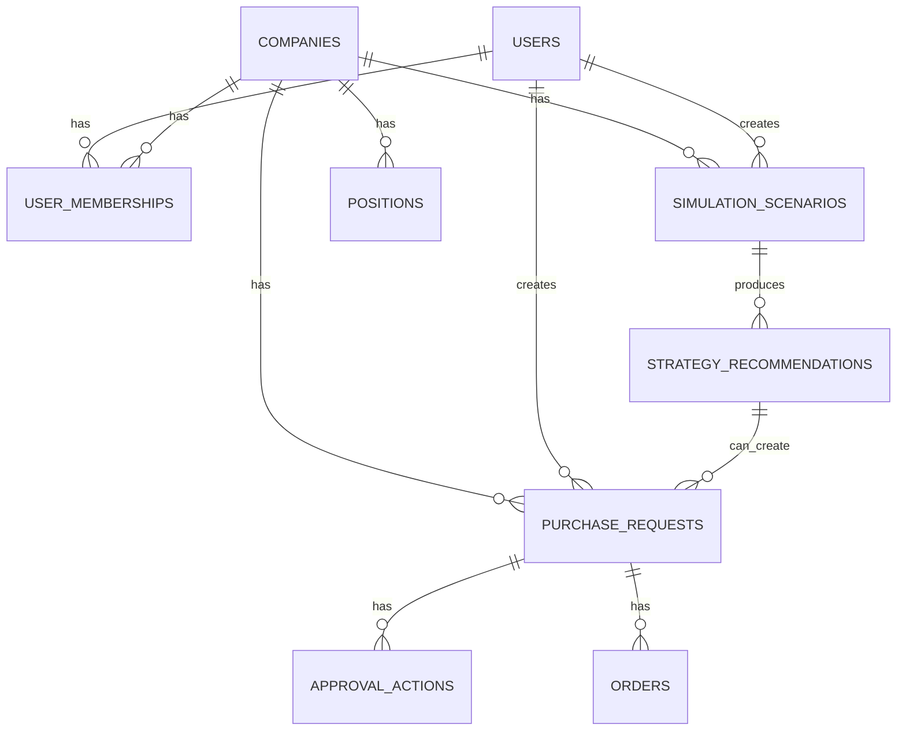

# Be-REAL Carbon Decision OS 차기 DB 스키마 문서

## 1. 문서 목적

이 문서는 Be-REAL Carbon Decision OS를 현재의 분석형 ESG 대시보드에서 탄소 의사결정 및 실행 지원 시스템으로 확장하기 위해 필요한 차기 데이터베이스 스키마를 정의한다.

문서 목적은 다음과 같다.

- 현재 DB 구조의 한계를 정리한다.
- 앞으로 추가해야 할 핵심 테이블을 정의한다.
- 도메인 모델과 API 명세를 실제 저장 구조로 연결한다.
- 백엔드 구현 전에 데이터 모델 기준을 고정한다.

## 2. 현재 DB 구조 요약

현재 코드베이스 기준 핵심 테이블은 아래와 같다.

- `users`
- `dashboard_emissions`
- `industry_benchmarks`

현재 구조는 `조회` 중심으로는 충분히 유용하다. 특히 `dashboard_emissions`는 프론트에서 빠르게 읽기 좋은 비정규화 구조다.

하지만 다음과 같은 한계가 있다.

- 회사 자체를 독립 엔티티로 관리하지 않는다.
- 사용자와 회사의 관계가 문자열 수준이다.
- 시뮬레이션 이력을 저장하지 않는다.
- 전략 추천 결과를 저장하지 않는다.
- 구매 요청, 승인, 주문, 포지션을 저장할 수 없다.
- 감사 로그를 남길 수 없다.

즉, 현재 구조는 “상태를 보여주는 제품”에는 적합하지만, “의사결정과 실행을 관리하는 제품”에는 부족하다.

## 3. 설계 원칙

- 기존 조회용 테이블은 유지한다.
- 차기 운영 테이블은 새로 추가한다.
- 조회용 데이터와 운영용 데이터를 분리한다.
- 문자열 `company_name` 의존도를 줄이고 `company_id` 중심 관계를 만든다.
- 요청과 주문을 분리한다.
- 상태 변경은 이력 테이블로 남긴다.

## 4. 차기 핵심 테이블 목록

이번 스키마에서 우선적으로 추가할 테이블은 아래와 같다.

- `companies`
- `user_memberships`
- `simulation_scenarios`
- `strategy_recommendations`
- `purchase_requests`
- `approval_actions`
- `orders`
- `positions`
- `audit_logs`

## 5. 테이블 상세 정의

## 5.1 companies

### 목적

- 시스템의 기업 단위를 독립적으로 관리한다.

### 컬럼 제안

| 컬럼명 | 타입 | 제약 | 설명 |
|---|---|---|---|
| id | INT | PK, AI | 회사 ID |
| name | VARCHAR(255) | NOT NULL, UNIQUE | 회사명 |
| industry | VARCHAR(100) | NULL | 업종 |
| country | VARCHAR(100) | NULL | 국가 |
| base_currency | VARCHAR(10) | NOT NULL DEFAULT 'KRW' | 기준 통화 |
| default_market | VARCHAR(20) | NULL | 기본 배출권 시장 |
| status | VARCHAR(20) | NOT NULL DEFAULT 'active' | 회사 상태 |
| created_at | DATETIME | NOT NULL | 생성일 |
| updated_at | DATETIME | NOT NULL | 수정일 |

### 비고

- 기존 `users.company_name`, `dashboard_emissions.company_name`은 점진적으로 `companies.id`와 연결하도록 전환한다.

## 5.2 user_memberships

### 목적

- 사용자와 회사의 소속 관계 및 역할을 정의한다.

### 컬럼 제안

| 컬럼명 | 타입 | 제약 | 설명 |
|---|---|---|---|
| id | INT | PK, AI | 소속 ID |
| user_id | INT | FK(users.id), NOT NULL | 사용자 ID |
| company_id | INT | FK(companies.id), NOT NULL | 회사 ID |
| role | VARCHAR(30) | NOT NULL | 역할 |
| status | VARCHAR(20) | NOT NULL DEFAULT 'active' | 소속 상태 |
| joined_at | DATETIME | NOT NULL | 참여일 |
| created_at | DATETIME | NOT NULL | 생성일 |
| updated_at | DATETIME | NOT NULL | 수정일 |

### 역할 예시

- `viewer`
- `analyst`
- `requester`
- `approver`
- `admin`

### 인덱스 제안

- `(user_id, company_id)` unique
- `company_id`
- `role`

## 5.3 simulation_scenarios

### 목적

- 사용자가 저장한 시뮬레이션 입력값과 계산 결과를 보관한다.

### 컬럼 제안

| 컬럼명 | 타입 | 제약 | 설명 |
|---|---|---|---|
| id | BIGINT | PK, AI | 시나리오 ID |
| company_id | INT | FK(companies.id), NOT NULL | 회사 ID |
| created_by | INT | FK(users.id), NOT NULL | 생성 사용자 |
| name | VARCHAR(255) | NULL | 시나리오 이름 |
| base_year | INT | NULL | 기준 연도 |
| price_scenario | VARCHAR(30) | NOT NULL | 가격 시나리오 |
| custom_price | DECIMAL(18,2) | NULL | 사용자 입력 가격 |
| allocation_change | VARCHAR(30) | NOT NULL | 무상할당 변화 유형 |
| emission_change_pct | DECIMAL(8,2) | NOT NULL DEFAULT 0 | 배출량 변화율 |
| auction_enabled | BOOLEAN | NOT NULL DEFAULT FALSE | 경매 사용 여부 |
| auction_target_pct | DECIMAL(8,2) | NULL | 경매 비율 |
| budget_amount | DECIMAL(18,2) | NULL | 예산 |
| budget_currency | VARCHAR(10) | NOT NULL DEFAULT 'KRW' | 예산 통화 |
| eur_krw_rate | DECIMAL(18,4) | NULL | 환율 |
| result_summary_json | JSON | NULL | 계산 결과 요약 |
| status | VARCHAR(20) | NOT NULL DEFAULT 'saved' | 시나리오 상태 |
| created_at | DATETIME | NOT NULL | 생성일 |
| updated_at | DATETIME | NOT NULL | 수정일 |

### result_summary_json 예시

```json
{
  "net_exposure": 120000,
  "compliance_cost": 1980000000,
  "overseas_cost": 420000000,
  "integrated_total_cost": 2400000000,
  "risk_label": "CAUTION"
}
```

### 인덱스 제안

- `company_id`
- `created_by`
- `created_at`

## 5.4 strategy_recommendations

### 목적

- 시뮬레이션 결과 기반 전략 제안을 저장한다.

### 컬럼 제안

| 컬럼명 | 타입 | 제약 | 설명 |
|---|---|---|---|
| id | BIGINT | PK, AI | 전략 ID |
| scenario_id | BIGINT | FK(simulation_scenarios.id), NOT NULL | 시나리오 ID |
| company_id | INT | FK(companies.id), NOT NULL | 회사 ID |
| strategy_type | VARCHAR(50) | NOT NULL | 전략 유형 |
| title | VARCHAR(255) | NOT NULL | 전략 제목 |
| summary | TEXT | NOT NULL | 전략 요약 |
| rationale | TEXT | NULL | 추천 이유 |
| estimated_volume | DECIMAL(18,4) | NULL | 예상 물량 |
| estimated_total_cost | DECIMAL(18,2) | NULL | 예상 총비용 |
| estimated_budget_ratio | DECIMAL(8,2) | NULL | 예산 대비 비율 |
| risk_level | VARCHAR(20) | NOT NULL | 리스크 레벨 |
| target_alignment_score | DECIMAL(8,2) | NULL | 목표 정렬 점수 |
| recommended | BOOLEAN | NOT NULL DEFAULT FALSE | 추천안 여부 |
| created_at | DATETIME | NOT NULL | 생성일 |
| updated_at | DATETIME | NOT NULL | 수정일 |

### 전략 유형 예시

- `immediate_buy`
- `split_buy`
- `budget_defense`
- `abatement_priority`

### 인덱스 제안

- `scenario_id`
- `company_id`
- `recommended`

## 5.5 purchase_requests

### 목적

- 전략 또는 시뮬레이션 결과를 기반으로 생성된 구매 요청을 저장한다.

### 컬럼 제안

| 컬럼명 | 타입 | 제약 | 설명 |
|---|---|---|---|
| id | BIGINT | PK, AI | 요청 ID |
| company_id | INT | FK(companies.id), NOT NULL | 회사 ID |
| scenario_id | BIGINT | FK(simulation_scenarios.id), NULL | 시나리오 ID |
| strategy_recommendation_id | BIGINT | FK(strategy_recommendations.id), NULL | 전략 추천 ID |
| requested_by | INT | FK(users.id), NOT NULL | 요청 생성자 |
| title | VARCHAR(255) | NOT NULL | 요청 제목 |
| description | TEXT | NULL | 요청 설명 |
| request_type | VARCHAR(50) | NOT NULL | 요청 유형 |
| market | VARCHAR(20) | NOT NULL | 시장 |
| requested_volume | DECIMAL(18,4) | NOT NULL | 요청 물량 |
| estimated_price | DECIMAL(18,2) | NULL | 예상 단가 |
| estimated_total_cost | DECIMAL(18,2) | NULL | 예상 총비용 |
| currency | VARCHAR(10) | NOT NULL DEFAULT 'KRW' | 통화 |
| budget_limit | DECIMAL(18,2) | NULL | 예산 한도 |
| risk_level | VARCHAR(20) | NOT NULL | 리스크 수준 |
| status | VARCHAR(30) | NOT NULL DEFAULT 'draft' | 요청 상태 |
| submitted_at | DATETIME | NULL | 제출일 |
| approved_at | DATETIME | NULL | 승인일 |
| rejected_at | DATETIME | NULL | 반려일 |
| executed_at | DATETIME | NULL | 실행 완료일 |
| created_at | DATETIME | NOT NULL | 생성일 |
| updated_at | DATETIME | NOT NULL | 수정일 |

### 상태 예시

- `draft`
- `submitted`
- `approved`
- `rejected`
- `execution_pending`
- `executed`
- `cancelled`

### 요청 유형 예시

- `allowance_purchase`
- `market_entry`
- `budget_reservation`

### 인덱스 제안

- `company_id`
- `requested_by`
- `status`
- `created_at`

## 5.6 approval_actions

### 목적

- 구매 요청에 대한 상태 변경 및 승인 이력을 저장한다.

### 컬럼 제안

| 컬럼명 | 타입 | 제약 | 설명 |
|---|---|---|---|
| id | BIGINT | PK, AI | 승인 이력 ID |
| purchase_request_id | BIGINT | FK(purchase_requests.id), NOT NULL | 요청 ID |
| acted_by | INT | FK(users.id), NOT NULL | 행위 사용자 |
| action_type | VARCHAR(30) | NOT NULL | 행위 유형 |
| comment | TEXT | NULL | 코멘트 |
| created_at | DATETIME | NOT NULL | 행위 시각 |

### action_type 예시

- `submit`
- `approve`
- `reject`
- `request_revision`
- `cancel`

### 인덱스 제안

- `purchase_request_id`
- `acted_by`
- `created_at`

## 5.7 orders

### 목적

- 승인된 요청 이후 실제 실행 단위를 저장한다.

### 컬럼 제안

| 컬럼명 | 타입 | 제약 | 설명 |
|---|---|---|---|
| id | BIGINT | PK, AI | 주문 ID |
| purchase_request_id | BIGINT | FK(purchase_requests.id), NOT NULL | 요청 ID |
| company_id | INT | FK(companies.id), NOT NULL | 회사 ID |
| market | VARCHAR(20) | NOT NULL | 시장 |
| order_type | VARCHAR(30) | NOT NULL | 주문 유형 |
| volume | DECIMAL(18,4) | NOT NULL | 주문 물량 |
| target_price | DECIMAL(18,2) | NULL | 목표 가격 |
| executed_price | DECIMAL(18,2) | NULL | 실행 가격 |
| currency | VARCHAR(10) | NOT NULL DEFAULT 'KRW' | 통화 |
| status | VARCHAR(30) | NOT NULL DEFAULT 'pending' | 주문 상태 |
| placed_at | DATETIME | NULL | 주문 생성 시각 |
| executed_at | DATETIME | NULL | 체결 시각 |
| created_at | DATETIME | NOT NULL | 생성일 |
| updated_at | DATETIME | NOT NULL | 수정일 |

### 상태 예시

- `pending`
- `placed`
- `partially_filled`
- `filled`
- `cancelled`
- `failed`

### 인덱스 제안

- `purchase_request_id`
- `company_id`
- `status`
- `created_at`

## 5.8 positions

### 목적

- 회사별 현재 확보 물량과 평균 단가를 저장한다.

### 컬럼 제안

| 컬럼명 | 타입 | 제약 | 설명 |
|---|---|---|---|
| id | BIGINT | PK, AI | 포지션 ID |
| company_id | INT | FK(companies.id), NOT NULL | 회사 ID |
| market | VARCHAR(20) | NOT NULL | 시장 |
| holding_volume | DECIMAL(18,4) | NOT NULL DEFAULT 0 | 보유 물량 |
| average_cost | DECIMAL(18,2) | NULL | 평균 단가 |
| currency | VARCHAR(10) | NOT NULL DEFAULT 'KRW' | 통화 |
| last_updated_at | DATETIME | NOT NULL | 마지막 갱신 시각 |
| created_at | DATETIME | NOT NULL | 생성일 |
| updated_at | DATETIME | NOT NULL | 수정일 |

### 인덱스 제안

- `(company_id, market)` unique

## 5.9 audit_logs

### 목적

- 주요 엔티티의 변경 이력을 범용적으로 기록한다.

### 컬럼 제안

| 컬럼명 | 타입 | 제약 | 설명 |
|---|---|---|---|
| id | BIGINT | PK, AI | 로그 ID |
| entity_type | VARCHAR(50) | NOT NULL | 엔티티 유형 |
| entity_id | BIGINT | NOT NULL | 엔티티 ID |
| action | VARCHAR(50) | NOT NULL | 액션 |
| actor_id | INT | FK(users.id), NULL | 수행 사용자 |
| before_json | JSON | NULL | 변경 전 값 |
| after_json | JSON | NULL | 변경 후 값 |
| created_at | DATETIME | NOT NULL | 기록 시각 |

### entity_type 예시

- `purchase_request`
- `order`
- `position`
- `strategy_recommendation`

### 인덱스 제안

- `(entity_type, entity_id)`
- `actor_id`
- `created_at`

## 6. 테이블 관계 요약



## 7. 기존 테이블과의 연결 전략

### 7.1 users

- 기존 `users` 테이블은 유지한다.
- 추후 `company_name`은 참조용으로 남기고, 실제 소속은 `user_memberships`로 관리한다.

### 7.2 dashboard_emissions

- 기존 조회용 핵심 테이블로 유지한다.
- 당장 마이그레이션하지 않는다.
- 단, 장기적으로는 `companies.id`와 매핑할 수 있는 정리 작업이 필요하다.

### 7.3 industry_benchmarks

- 기존 구조를 유지한다.

## 8. 추천 구현 순서

### 1차 도입 테이블

- `companies`
- `user_memberships`
- `simulation_scenarios`
- `strategy_recommendations`
- `purchase_requests`

이 단계에서 가능한 것:

- 회사 기준 모델 정리
- 시뮬레이션 저장
- 전략 추천 저장
- 구매 요청 생성

### 2차 도입 테이블

- `approval_actions`

이 단계에서 가능한 것:

- 제출/승인/반려 이력 저장
- 상태 전환 추적

### 3차 도입 테이블

- `orders`
- `positions`
- `audit_logs`

이 단계에서 가능한 것:

- 실행 기록
- 보유 포지션 추적
- 범용 감사 로그

## 9. 마이그레이션 전략 제안

### 단계 1. 신규 테이블 추가

- 기존 기능에 영향 없이 신규 운영 테이블만 먼저 추가한다.

### 단계 2. 백엔드 신규 API 연결

- 시뮬레이션 저장, 전략 추천, 구매 요청 API부터 연결한다.

### 단계 3. 프론트 신규 화면 연결

- 구매 요청 생성
- 요청 목록
- 요청 상세

### 단계 4. 승인 및 실행 확장

- 승인 상태 변경
- 주문 생성
- 포지션 반영

## 10. 권장 스키마 설계 메모

### JSON 컬럼은 어디까지 허용할 것인가

- `simulation_scenarios.result_summary_json`
- `audit_logs.before_json`
- `audit_logs.after_json`

이외 핵심 비즈니스 데이터는 가능한 한 정규 컬럼으로 보관하는 것이 좋다.

### 상태 컬럼은 ENUM보다 문자열 추천

- 초기에 상태가 자주 바뀔 수 있으므로, DB ENUM보다 애플리케이션 레벨 상수 관리가 유연하다.

### 금액과 물량은 DECIMAL 사용

- 정밀도 이슈 때문에 `FLOAT`보다 `DECIMAL`이 적합하다.

## 11. 다음 구현 연결 포인트

이 문서를 바탕으로 바로 이어질 수 있는 구현 작업은 다음과 같다.

1. SQLAlchemy 모델 초안 작성
2. Alembic 또는 초기 마이그레이션 스크립트 작성
3. 구매 요청 API 엔드포인트 구현
4. 시뮬레이션 저장 API 구현

현재 가장 추천하는 첫 구현 순서는 아래와 같다.

1. `companies`
2. `simulation_scenarios`
3. `strategy_recommendations`
4. `purchase_requests`
5. `approval_actions`

이 순서로 가면 문서에서 정의한 제품 흐름을 가장 빠르게 실제 기능으로 바꿀 수 있다.
