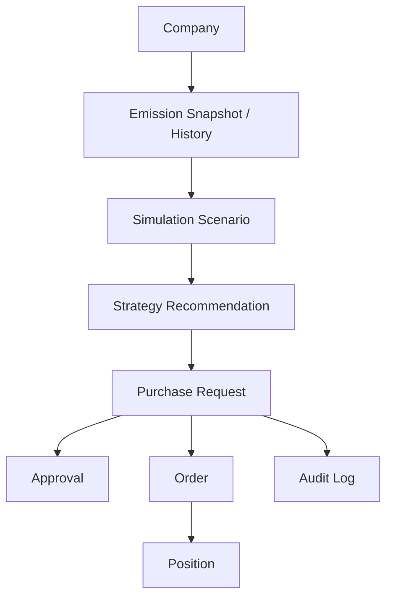
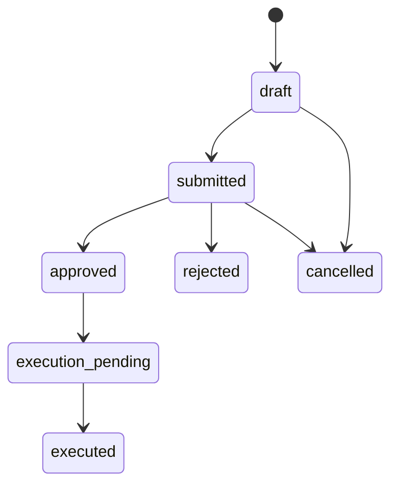
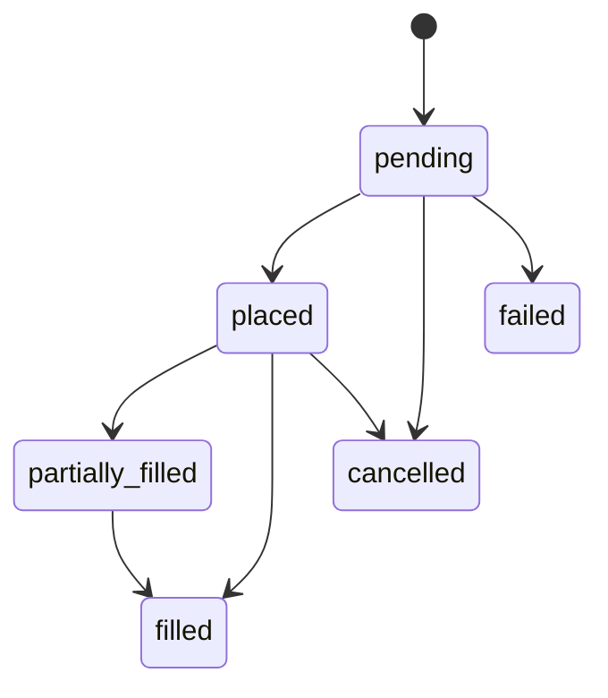

# Be-REAL Carbon Decision OS 도메인 모델 문서

## 1. 문서 목적

이 문서는 Be-REAL Carbon Decision OS를 분석형 대시보드에서 탄소 의사결정 및 실행 지원 시스템으로 확장하기 위해 필요한 핵심 도메인 개념을 정의한다.

문서 목적은 다음과 같다.

- 제품의 핵심 개체와 관계를 명확히 정리한다.
- 현재 시스템에 없는 운영 도메인을 정의한다.
- 이후 DB 설계, API 설계, 화면 설계의 기준을 만든다.
- 개발 중 용어 혼선을 줄이고 일관된 모델링 기준을 제공한다.

이 문서에서는 “현재 존재하는 모델”과 “앞으로 필요한 모델”을 함께 설명하되, 중심은 앞으로의 제품 확장에 필요한 목표 도메인 구조에 둔다.

## 2. 도메인 설계 원칙

도메인 설계는 아래 원칙을 따른다.

- 조회용 데이터와 운영용 데이터를 구분한다.
- 배출량 데이터는 “상태 진단”의 기준으로 본다.
- 전략 추천은 “해석된 제안”으로 본다.
- 구매 요청은 “의사결정 단위”로 본다.
- 주문은 “실행 단위”로 본다.
- 포지션은 “실행 결과의 누적 상태”로 본다.
- 감사 로그는 모든 주요 상태 변경을 추적할 수 있어야 한다.

## 3. 도메인 개요

장기적으로 시스템은 아래 흐름을 지원해야 한다.

이 구조에서 중요한 점은 `배출량 데이터`와 `구매 실행 데이터`를 같은 테이블에 섞지 않는 것이다.

## 4. 현재 존재하는 핵심 도메인

### 4.1 User

설명:

- 제품을 사용하는 사용자 계정

현재 역할:

- 인증
- 프로필 정보 보관
- 기본 역할 구분

현재 주요 속성:

- `id`
- `email`
- `company_name`
- `hashed_password`
- `nickname`
- `classification`
- `profile_image_url`
- `role`
- `is_admin`

현재 한계:

- 회사 소속을 문자열로만 가지고 있다.
- 승인자/실무자/조회자 같은 구체적 권한 모델이 없다.

### 4.2 DashboardEmission

설명:

- 회사의 연도별 배출량과 집약도 정보를 담는 조회용 데이터

현재 역할:

- 대시보드, 비교, 목표관리의 핵심 소스 데이터

현재 주요 속성:

- `company_id`
- `company_name`
- `year`
- `scope1`
- `scope2`
- `scope3`
- `allowance`
- `revenue`
- `carbon_intensity*`
- `energy_intensity`
- `base_year`
- `base_emissions`

현재 한계:

- 운영 워크플로우를 담는 모델은 아님
- 전략, 요청, 주문, 승인과의 관계가 없음

### 4.3 IndustryBenchmark

설명:

- 업계 기준선 데이터

현재 역할:

- Compare 탭에서 상대적 위치 판단

## 5. 목표 도메인 구조

앞으로 제품을 확장하기 위해서는 아래 도메인이 필요하다.

- Company
- UserMembership
- EmissionRecord
- MarketSnapshot
- SimulationScenario
- StrategyRecommendation
- PurchaseRequest
- ApprovalAction
- Order
- Position
- AuditLog

## 6. 핵심 도메인 정의

### 6.1 Company

설명:

- 시스템에서 관리하는 기업 단위

필요 이유:

- 현재는 `company_name`이 여러 곳에 문자열로 흩어져 있어 운영 모델 확장에 불리하다.
- 요청, 승인, 주문, 포지션은 반드시 회사 단위를 기준으로 묶여야 한다.

주요 속성 예시:

- `id`
- `name`
- `industry`
- `country`
- `base_currency`
- `default_market`
- `created_at`
- `updated_at`

관계:

- Company는 여러 User와 연결될 수 있다.
- Company는 여러 EmissionRecord를 가진다.
- Company는 여러 PurchaseRequest를 가진다.
- Company는 여러 Position을 가진다.

### 6.2 UserMembership

설명:

- 사용자가 어떤 회사에 어떤 역할로 속해 있는지를 정의하는 모델

필요 이유:

- 향후 승인자, 작성자, 조회자 권한을 나누기 위해 필요하다.

주요 속성 예시:

- `id`
- `user_id`
- `company_id`
- `role`
- `status`
- `joined_at`

역할 예시:

- `viewer`
- `analyst`
- `requester`
- `approver`
- `admin`

### 6.3 EmissionRecord

설명:

- 회사의 연도별 또는 기간별 배출량 원천 기록

필요 이유:

- 현재 `DashboardEmission`은 조회에 최적화된 비정규화 구조다.
- 장기적으로는 원천 데이터와 조회 데이터를 나누는 것이 낫다.

주요 속성 예시:

- `id`
- `company_id`
- `year`
- `scope1`
- `scope2`
- `scope3`
- `scope1_domestic`
- `scope2_domestic`
- `scope1_overseas`
- `scope2_overseas`
- `allowance`
- `revenue`
- `source`
- `verified`

관계:

- Company에 속한다.
- 시뮬레이션의 기준값으로 사용된다.

참고:

- 당장은 `DashboardEmission`을 그대로 사용하되, 장기적으로는 `EmissionRecord`와 조회용 테이블을 분리하는 것을 권장한다.

### 6.4 MarketSnapshot

설명:

- 특정 시점의 시장 가격과 환율 정보를 보관하는 모델

필요 이유:

- 시뮬레이션 근거와 요청 생성 시점의 시장 상태를 보존하려면 필요하다.

주요 속성 예시:

- `id`
- `market`
- `price`
- `currency`
- `fx_rate`
- `captured_at`
- `source`

시장 예시:

- `K-ETS`
- `EU-ETS`

### 6.5 SimulationScenario

설명:

- 사용자가 특정 시점에 실행한 시뮬레이션 입력과 결과를 저장하는 모델

필요 이유:

- 지금은 시뮬레이터 결과가 화면 안에서만 계산되고 사라진다.
- 추천 전략, 요청 생성, 이력 비교를 하려면 시나리오 저장이 필요하다.

주요 속성 예시:

- `id`
- `company_id`
- `created_by`
- `base_year`
- `price_scenario`
- `custom_price`
- `allocation_change`
- `emission_change`
- `auction_enabled`
- `auction_target_pct`
- `budget`
- `eur_krw_rate`
- `result_summary_json`
- `created_at`

핵심 관계:

- Company에 속한다.
- 여러 StrategyRecommendation의 기반이 된다.
- PurchaseRequest 생성의 출발점이 될 수 있다.

### 6.6 StrategyRecommendation

설명:

- 시뮬레이션 결과를 바탕으로 생성되는 전략 제안 단위

필요 이유:

- 숫자를 보여주는 것만으로는 의사결정 지원이 충분하지 않다.
- 전략안을 명시적으로 표현해야 요청 생성과 승인 흐름이 자연스럽다.

전략 예시:

- 즉시 매수형
- 분할 매수형
- 예산 방어형
- 감축 우선형

주요 속성 예시:

- `id`
- `scenario_id`
- `company_id`
- `strategy_type`
- `title`
- `summary`
- `rationale`
- `estimated_volume`
- `estimated_total_cost`
- `estimated_budget_ratio`
- `risk_level`
- `target_alignment_score`
- `recommended`
- `created_at`

중요 속성 설명:

- `strategy_type`: 전략의 분류
- `rationale`: 왜 이 전략을 추천하는지에 대한 설명
- `risk_level`: low / medium / high
- `target_alignment_score`: 장기 감축 목표와의 정렬 정도
- `recommended`: 추천안 여부

관계:

- 하나의 시뮬레이션 시나리오에서 여러 전략이 나올 수 있다.
- 하나의 전략은 하나 이상의 PurchaseRequest로 이어질 수 있다.

### 6.7 PurchaseRequest

설명:

- 실제 실행을 위한 내부 의사결정 요청 단위

이 모델이 중요한 이유:

- 제품이 분석 도구에서 운영 시스템으로 넘어가는 핵심 경계이기 때문이다.

주요 속성 예시:

- `id`
- `company_id`
- `scenario_id`
- `strategy_recommendation_id`
- `requested_by`
- `title`
- `description`
- `request_type`
- `market`
- `requested_volume`
- `estimated_price`
- `estimated_total_cost`
- `currency`
- `budget_limit`
- `risk_level`
- `status`
- `submitted_at`
- `approved_at`
- `rejected_at`
- `executed_at`
- `created_at`
- `updated_at`

상태 예시:

- `draft`
- `submitted`
- `approved`
- `rejected`
- `execution_pending`
- `executed`
- `cancelled`

설명:

- `draft`: 작성 중
- `submitted`: 승인 대기
- `approved`: 승인 완료
- `execution_pending`: 승인 이후 실행 대기
- `executed`: 주문 또는 실제 액션 완료

관계:

- Company에 속한다.
- User가 생성한다.
- StrategyRecommendation을 참조할 수 있다.
- 여러 ApprovalAction을 가진다.
- 여러 Order를 가질 수 있다.

### 6.8 ApprovalAction

설명:

- 구매 요청에 대한 승인/반려/보류 행위를 기록하는 모델

필요 이유:

- 요청 상태 변경 이력과 의사결정 근거를 남기기 위해 필요하다.

주요 속성 예시:

- `id`
- `purchase_request_id`
- `acted_by`
- `action_type`
- `comment`
- `acted_at`

행위 예시:

- `submit`
- `approve`
- `reject`
- `request_revision`
- `cancel`

설명:

- 하나의 요청은 여러 승인 액션을 가질 수 있다.
- 최종 상태는 PurchaseRequest에 요약되고, 세부 이력은 ApprovalAction에 저장된다.

### 6.9 Order

설명:

- 승인된 요청이 실제 실행 단계로 넘어갔을 때 생성되는 실행 단위

필요 이유:

- 요청과 실제 실행을 분리해야 운영 이력이 명확해진다.
- 한 요청이 여러 주문으로 나뉠 수도 있다.

주요 속성 예시:

- `id`
- `purchase_request_id`
- `company_id`
- `market`
- `order_type`
- `volume`
- `target_price`
- `executed_price`
- `currency`
- `status`
- `placed_at`
- `executed_at`

상태 예시:

- `pending`
- `placed`
- `partially_filled`
- `filled`
- `cancelled`
- `failed`

설명:

- 실거래 연동이 없는 단계에서도 내부 실행 기록 모델로 사용할 수 있다.

### 6.10 Position

설명:

- 회사가 현재 보유한 탄소 배출권 또는 확보한 조달 상태를 나타내는 누적 상태 모델

필요 이유:

- 단순 요청/주문만으로는 현재 포지션을 한눈에 보기 어렵다.

주요 속성 예시:

- `id`
- `company_id`
- `market`
- `holding_volume`
- `average_cost`
- `currency`
- `last_updated_at`

활용 예시:

- 현재 확보 물량 추적
- 평균 매입 단가 확인
- 잔여 노출량 계산 보조

### 6.11 AuditLog

설명:

- 중요한 도메인 변경 이력을 남기는 범용 로그 모델

필요 이유:

- 기업용 시스템에서 책임 추적과 신뢰 확보를 위해 필요하다.

주요 속성 예시:

- `id`
- `entity_type`
- `entity_id`
- `action`
- `actor_id`
- `before_json`
- `after_json`
- `created_at`

활용 예시:

- 요청 상태 변경 추적
- 전략 수정 추적
- 주문 상태 변경 추적

## 7. 도메인 간 관계 요약

### 핵심 관계

- Company는 여러 UserMembership, EmissionRecord, PurchaseRequest, Position을 가진다.
- User는 여러 Company에 속할 수 있다.
- SimulationScenario는 Company 기준으로 생성된다.
- StrategyRecommendation은 SimulationScenario를 기반으로 생성된다.
- PurchaseRequest는 StrategyRecommendation 또는 SimulationScenario로부터 생성될 수 있다.
- ApprovalAction은 PurchaseRequest의 상태 전환 이력을 남긴다.
- Order는 PurchaseRequest의 실행 단위다.
- Position은 Order 결과의 누적 상태를 표현한다.
- AuditLog는 주요 도메인 변경 이력을 보관한다.

## 8. 도메인 상태 흐름

### 8.1 구매 요청 상태 흐름

### 8.2 주문 상태 흐름

## 9. 현재 구조에서 바로 도입하기 좋은 최소 도메인

모든 도메인을 한 번에 도입할 필요는 없다. 현재 제품 단계에서 가장 먼저 추가하면 좋은 최소 도메인은 아래 4개다.

- Company
- SimulationScenario
- StrategyRecommendation
- PurchaseRequest

이 4개만 있어도 다음이 가능해진다.

- 시뮬레이션 저장
- 전략 추천 저장
- 전략 기반 구매 요청 생성
- 요청 목록 및 상태 추적

즉, 제품 완성도를 빠르게 올리기 위한 최소 운영 도메인 세트라고 볼 수 있다.

## 10. 추천 구현 순서

### 1단계

- Company 도입
- User와 Company 관계 정리

### 2단계

- SimulationScenario 저장 구조 도입
- StrategyRecommendation 저장 구조 도입

### 3단계

- PurchaseRequest 생성 및 상태 모델 도입
- 요청 목록/상세/상태 전환 구현

### 4단계

- ApprovalAction 도입
- 역할 기반 승인 흐름 도입

### 5단계

- Order / Position / AuditLog 확장

## 11. 구현 시 주의사항

### 조회용 모델과 운영용 모델을 분리할 것

- `DashboardEmission`은 조회 전용으로 유지하고, 운영 모델과 직접 섞지 않는 것이 좋다.

### 문자열 company_name 중심 구조를 줄일 것

- 장기적으로는 `company_id`를 기준으로 관계를 정리해야 한다.

### 요청과 주문을 분리할 것

- 의사결정 요청과 실제 실행은 성격이 다르므로 모델을 분리해야 한다.

### 상태 변경 이력을 남길 것

- 기업용 시스템의 신뢰성을 위해 상태 변경 추적은 필수다.

## 12. 다음 단계 제안

이 문서 다음으로 바로 이어서 만들면 좋은 문서는 아래 문서다.

- `API_SPEC.md`

가장 먼저 정리할 API 범위:

- 시뮬레이션 저장 API
- 전략 추천 조회 API
- 구매 요청 생성 API
- 구매 요청 목록 API
- 구매 요청 상태 변경 API

이 API 명세가 정리되면 실제 구현 순서까지 바로 연결할 수 있다.
