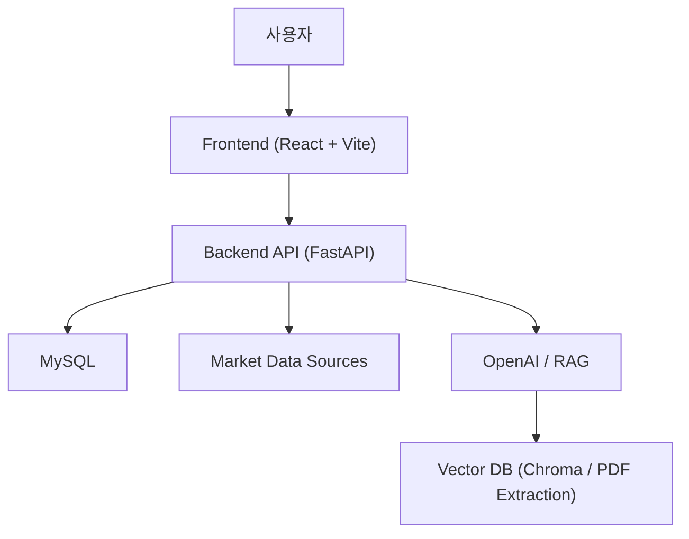
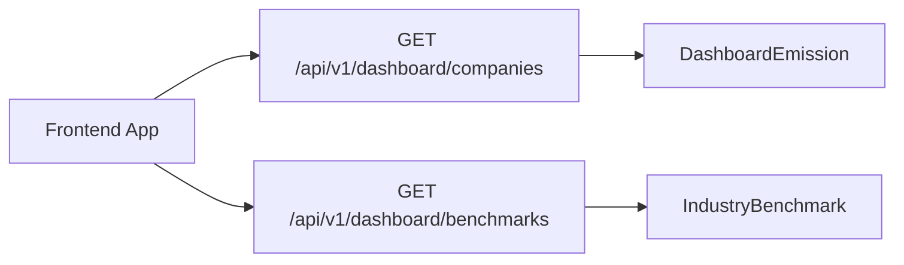
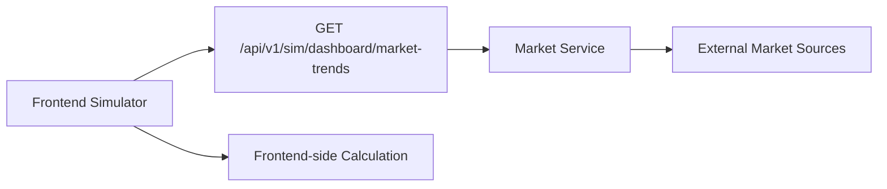
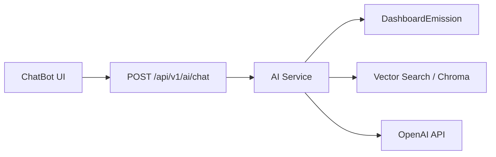
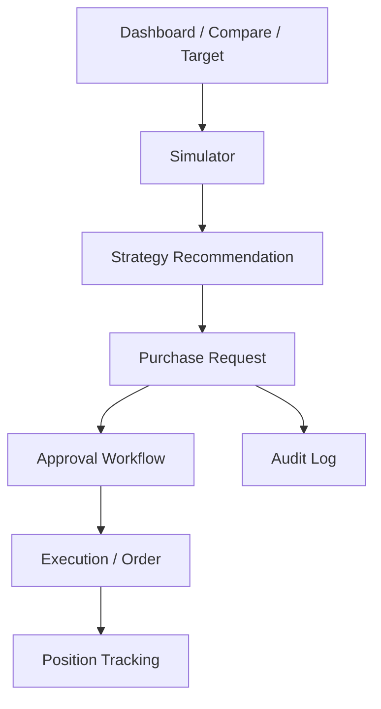

# Be-REAL Carbon Decision OS 시스템 설계 문서

## 1. 문서 목적

이 문서는 Be-REAL Carbon Decision OS의 현재 시스템 구조를 정리하고, 앞으로 제품을 기업용 탄소 의사결정 및 실행 지원 플랫폼으로 확장하기 위한 설계 방향을 정의한다.

문서 목적은 다음과 같다.

- 현재 프론트엔드, 백엔드, 데이터 계층 구조를 명확하게 설명한다.
- 데이터 흐름과 책임 분리를 정리한다.
- 현재 구조의 한계와 확장 포인트를 식별한다.
- 구매 요청, 승인, 실행 기능을 붙일 때 어떤 구조로 확장할지 기준을 제공한다.

## 2. 시스템 목표

이 시스템은 장기적으로 다음 흐름을 지원해야 한다.

1. 기업의 탄소 배출 및 노출 현황 조회
2. 경쟁사 및 업계 기준 비교
3. 시장 데이터 기반 시뮬레이션
4. 장기 감축 목표와의 정렬 확인
5. AI 기반 해석 및 전략 설명
6. 구매 요청 생성
7. 승인 및 실행 상태 추적
8. 향후 거래 및 포지션 관리 확장

현재 시스템은 1~5까지는 일부 구현되어 있으며, 6~8은 아직 구조 설계 단계에 가깝다.

## 3. 현재 전체 구조

현재 시스템은 크게 다음 4개 계층으로 구성된다.

- 프론트엔드 계층
- 백엔드 API 계층
- 데이터 저장 계층
- 외부 데이터 및 AI 계층

### 3.1 개념도

## 4. 프론트엔드 설계

### 4.1 기술 스택

- React 18
- TypeScript
- Vite
- Recharts
- Framer Motion
- Fetch / Axios 기반 API 호출

### 4.2 현재 구조 특징

프론트엔드는 라우터 기반 멀티 페이지 앱처럼 동작하지만, 실제 핵심 상태와 데이터 로딩은 [App.tsx](/Users/jm/ESG_bereal_3rd/frontend/src/App.tsx)에 집중되어 있다.

현재 특징:

- 전역 상태 라이브러리 없이 `App.tsx`에서 주요 상태를 통합 관리
- 화면 기능은 `features/` 단위로 분리
- API 호출 일부는 `services/`로 분리
- 탭 전환, 인증 가드, 데이터 초기 로딩이 루트 컴포넌트에 집중

### 4.3 주요 프론트 모듈

#### App Shell

역할:

- 라우팅 해석
- 인증 상태 체크
- 초기 데이터 로딩
- 공통 상태 보관
- 각 기능 화면에 props 전달

관련 파일:

- [App.tsx](/Users/jm/ESG_bereal_3rd/frontend/src/App.tsx)

#### Feature Components

주요 기능 화면:

- [DashboardTab.tsx](/Users/jm/ESG_bereal_3rd/frontend/src/features/대시보드/DashboardTab.tsx)
- [CompareTab.tsx](/Users/jm/ESG_bereal_3rd/frontend/src/features/경쟁사비교/CompareTab.tsx)
- [SimulatorTab.tsx](/Users/jm/ESG_bereal_3rd/frontend/src/features/시뮬레이터/SimulatorTab.tsx)
- [TargetTab.tsx](/Users/jm/ESG_bereal_3rd/frontend/src/features/목표설정/TargetTab.tsx)
- [ChatBot.tsx](/Users/jm/ESG_bereal_3rd/frontend/src/features/챗봇/ChatBot.tsx)
- [Profile.tsx](/Users/jm/ESG_bereal_3rd/frontend/src/features/profile/Profile.tsx)

#### API Service Layer

역할:

- 인증 API
- 프로필 API
- 시장 데이터 API
- AI API 연결

관련 파일:

- [api.ts](/Users/jm/ESG_bereal_3rd/frontend/src/services/api.ts)
- [authApi.ts](/Users/jm/ESG_bereal_3rd/frontend/src/services/authApi.ts)
- [profileApi.ts](/Users/jm/ESG_bereal_3rd/frontend/src/services/profileApi.ts)

### 4.4 현재 프론트 구조의 장점

- 기능 화면이 분리되어 있어 UI 확장이 비교적 쉽다.
- 하나의 루트에서 데이터 흐름을 파악하기 쉬워 현재 상태 이해가 빠르다.
- 탭 기반 제품 흐름을 빠르게 구현하기에 적합하다.

### 4.5 현재 프론트 구조의 한계

- `App.tsx`에 비즈니스 로직과 계산이 많이 집중되어 있다.
- 추천 전략, 구매 요청 같은 신규 도메인을 붙이면 props 흐름이 더 복잡해질 가능성이 높다.
- 시뮬레이터와 목표관리 계산 로직이 화면 계층과 밀접하게 섞여 있다.
- 상태가 커질수록 유지보수성이 떨어질 수 있다.

### 4.6 프론트엔드 확장 방향

단기 방향:

- `App.tsx`의 계산 로직을 도메인별 훅 또는 서비스 모듈로 분리
- 시뮬레이터 결과 계산 로직 분리
- 추천 전략 로직 별도 모듈화

중기 방향:

- 구매 요청 도메인 상태 분리
- 역할/권한 기반 UI 분기 구조 도입
- 요청 목록/상세/상태 관리 페이지 추가

## 5. 백엔드 설계

### 5.1 기술 스택

- FastAPI
- SQLAlchemy
- MySQL
- OpenAI API
- ChromaDB 및 PDF 기반 벡터 검색 연동

### 5.2 현재 API 구조

백엔드는 라우터 중심 구조로 기능을 나누고 있다.

현재 주요 라우터:

- `auth`
- `profile`
- `dashboard`
- `simulator`
- `ai`

관련 파일:

- [main.py](/Users/jm/ESG_bereal_3rd/backend/app/main.py)
- [auth.py](/Users/jm/ESG_bereal_3rd/backend/app/routers/auth.py)
- [profile.py](/Users/jm/ESG_bereal_3rd/backend/app/routers/profile.py)
- [dashboard.py](/Users/jm/ESG_bereal_3rd/backend/app/routers/dashboard.py)
- [simulator.py](/Users/jm/ESG_bereal_3rd/backend/app/routers/simulator.py)
- [ai.py](/Users/jm/ESG_bereal_3rd/backend/app/routers/ai.py)

### 5.3 현재 백엔드 역할 분리

#### 인증 라우터

역할:

- 회원가입
- 로그인
- JWT 발급 및 현재 사용자 확인

#### 프로필 라우터

역할:

- 프로필 조회 및 수정
- 아바타 업로드
- 이메일/비밀번호 변경
- 계정 삭제

#### 대시보드 라우터

역할:

- 회사별 배출량 데이터 제공
- 업계 벤치마크 제공
- 경쟁사 비교 인사이트 생성

#### 시뮬레이터 라우터

역할:

- 시장 데이터 조회
- 시뮬레이션 차트 데이터 제공

#### AI 라우터

역할:

- 전략 생성
- 스트리밍 챗봇 응답
- 자연어 SQL 생성

### 5.4 서비스 레이어

현재 주요 서비스는 다음과 같다.

- `market_data.py`
- `ai_service.py`
- `emission_extractor.py`
- `extractors/*`

#### Market Service

역할:

- 탄소 시장 가격 조회
- 히스토리 데이터 가공

#### AI Service

역할:

- OpenAI 호출
- RAG 초기화
- DB 기반 회사 데이터 조회
- 벡터 검색 결과를 포함한 컨텍스트 구성
- 스트리밍 응답 생성

관련 파일:

- [ai_service.py](/Users/jm/ESG_bereal_3rd/backend/app/services/ai_service.py)

### 5.5 현재 백엔드 구조의 장점

- FastAPI 라우터 구조가 명확하다.
- 인증, 프로필, 대시보드, AI 기능이 분리되어 있다.
- AI 및 시장 데이터 연동이 별도 서비스로 빠져 있다.

### 5.6 현재 백엔드 구조의 한계

- 제품 핵심 도메인이 아직 “배출 데이터 조회” 중심이다.
- 구매 요청, 승인, 주문, 포지션 등 운영 도메인이 없다.
- 일부 계산 책임이 프론트에 남아 있어 백엔드 중심 도메인화가 약하다.
- 대시보드용 비정규화 테이블에 의존하는 구조라 도메인 확장 시 한계가 있다.

### 5.7 백엔드 확장 방향

단기 방향:

- 구매 요청 관련 라우터 추가
- 추천 전략 생성 API 정리
- 요청 상태 관리 API 설계

중기 방향:

- approval, request, order, position 도메인 추가
- 감사 로그 도입
- 권한 기반 API 분기 도입

## 6. 데이터 저장 계층 설계

### 6.1 현재 DB 구조

현재 확인된 핵심 모델은 다음과 같다.

- `User`
- `DashboardEmission`
- `IndustryBenchmark`

관련 파일:

- [models.py](/Users/jm/ESG_bereal_3rd/backend/app/models.py)
- [database.py](/Users/jm/ESG_bereal_3rd/backend/app/database.py)

### 6.2 현재 모델 역할

#### User

역할:

- 사용자 계정 및 프로필 정보 저장

주요 속성:

- 이메일
- 회사명
- 비밀번호 해시
- 닉네임
- 분류
- 프로필 이미지
- 역할

#### DashboardEmission

역할:

- 기업의 연도별 배출량 및 관련 지표를 대시보드 조회용으로 저장

주요 속성:

- 회사 ID / 회사명
- 연도
- Scope 1, 2, 3
- 무상할당량
- 매출
- 탄소/에너지 집약도
- 기준연도 / 기준 배출량

특징:

- 조회 중심의 비정규화 구조
- 프론트에서 한 번에 읽기 쉽도록 설계됨

#### IndustryBenchmark

역할:

- 업계 기준선 제공

주요 속성:

- 업종
- 연도
- 상위 10%
- 중앙값
- 평균값

### 6.3 현재 데이터 계층의 장점

- 초기 제품 구현에는 단순하고 빠르다.
- 조회 성능과 프론트 연동이 간단하다.

### 6.4 현재 데이터 계층의 한계

- 운영 도메인을 담기에 모델이 부족하다.
- 회사 자체를 독립 엔티티로 관리하지 않는다.
- 배출량, 전략, 요청, 주문, 승인 간 관계가 없다.
- 현재 구조만으로는 구매 요청 및 실행 이력을 자연스럽게 표현하기 어렵다.

## 7. 외부 데이터 및 AI 설계

### 7.1 시장 데이터

현재 외부 데이터 소스:

- yfinance
- FinanceDataReader
- 환율 API

역할:

- K-ETS / EU-ETS 가격 조회
- 차트 시계열 데이터 제공

현재 특징:

- 일부는 백엔드에서 조회
- 일부는 프론트에서 직접 환율 API를 호출

개선 방향:

- 시장 및 환율 데이터는 가능하면 백엔드에서 통합 제공
- 실패 시 fallback 정책 명확화

### 7.2 AI 및 RAG

현재 구조:

- OpenAI API 사용
- ChromaDB 기반 벡터 검색 사용 가능
- PDF_Extraction 결과를 벡터 검색 컨텍스트로 활용
- 회사명과 연도 추출 후 DB 데이터와 결합해 응답 생성

현재 역할:

- 질의응답
- 전략 설명
- 비교 인사이트 생성
- 자연어 SQL 생성

현재 한계:

- 챗봇 중심으로 설계되어 있어 제품 워크플로우와 강하게 결합되진 않음
- 추천 전략, 요청 생성, 승인 요약 등 제품 기능으로 확장 여지가 큼

확장 방향:

- 시뮬레이터 전략 설명 API
- 구매 요청용 AI 요약
- 경영진 보고서 요약 생성

## 8. 현재 데이터 흐름

### 8.1 대시보드 흐름

### 8.2 시뮬레이터 흐름

설명:

- 현재 시뮬레이터의 핵심 계산은 프론트에서 수행된다.
- 장기적으로는 일부 도메인 계산을 백엔드로 이동하는 것이 적절하다.

### 8.3 AI 챗봇 흐름

## 9. 목표 구조

현재 구조 위에 다음 도메인을 추가하는 것이 목표다.

- Strategy Recommendation
- Purchase Request
- Approval Workflow
- Order
- Position
- Audit Log

### 9.1 목표 개념도

### 9.2 새로 필요한 백엔드 도메인

#### Strategy Recommendation

역할:

- 시뮬레이션 결과를 바탕으로 전략안을 생성

예시:

- 즉시 매수형
- 분할 매수형
- 예산 방어형

#### Purchase Request

역할:

- 사용자가 선택한 전략을 실행 가능한 요청으로 저장

포함 정보 예시:

- 회사
- 전략 유형
- 예상 구매량
- 예상 비용
- 요청 사유
- 리스크 설명

#### Approval Workflow

역할:

- 요청을 승인/반려/보류 상태로 관리

#### Order

역할:

- 향후 실제 거래 실행 또는 외부 연동의 단위

#### Position

역할:

- 보유 배출권, 평균 단가, 잔여 노출량 추적

#### Audit Log

역할:

- 누가 언제 무엇을 했는지 기록

## 10. 권장 아키텍처 개선 방향

### 10.1 프론트엔드

- `App.tsx` 비즈니스 로직 축소
- 계산 및 추천 로직을 도메인 모듈로 이동
- 요청 및 승인 관련 페이지 분리

### 10.2 백엔드

- 운영 도메인 라우터 추가
- 전략 추천 API 정리
- 요청/승인/주문 상태 머신 도입

### 10.3 데이터 계층

- 회사, 요청, 승인, 주문, 포지션 모델 추가
- 조회용 비정규화 테이블과 운영 도메인 테이블을 분리

### 10.4 AI 계층

- 챗봇 중심에서 제품 액션 보조 중심으로 확장
- 전략 설명, 요청 요약, 보고서 생성 기능 강화

## 11. 단기 설계 결정 제안

현재 시점에서 가장 중요한 설계 결정은 아래 3가지다.

### 결정 1. 시뮬레이터를 핵심 업무 화면으로 본다

이유:

- 현재 제품 가치가 가장 높고 향후 구매 요청 흐름의 시작점이기 때문이다.

### 결정 2. 구매 요청을 거래보다 먼저 설계한다

이유:

- 실거래 연동 없이도 내부 의사결정 도구로서 제품 가치가 크게 올라가기 때문이다.

### 결정 3. 조회용 데이터와 운영용 데이터를 분리한다

이유:

- `DashboardEmission`은 빠른 조회에는 적합하지만 운영 워크플로우를 담기엔 한계가 있기 때문이다.

## 12. 다음 설계 문서 추천

이 문서 다음으로 가장 중요한 문서는 아래 문서다.

- `DOMAIN_MODEL.md`

이 문서에서 구체적으로 정의해야 할 항목:

- Company
- StrategyRecommendation
- PurchaseRequest
- Approval
- Order
- Position
- AuditLog

이 도메인 정의가 끝나면 이후 DB 설계와 API 설계가 훨씬 수월해진다.
