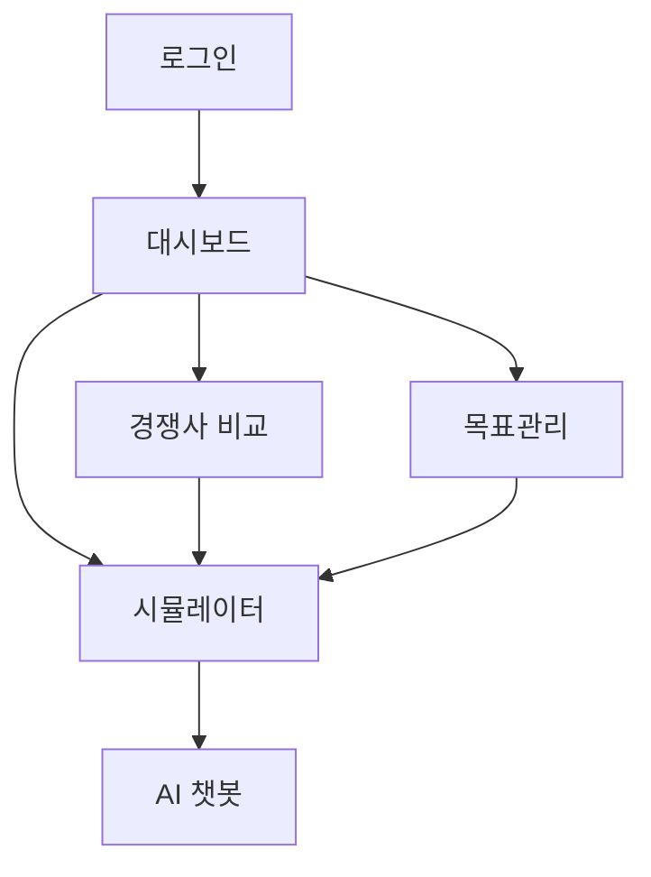
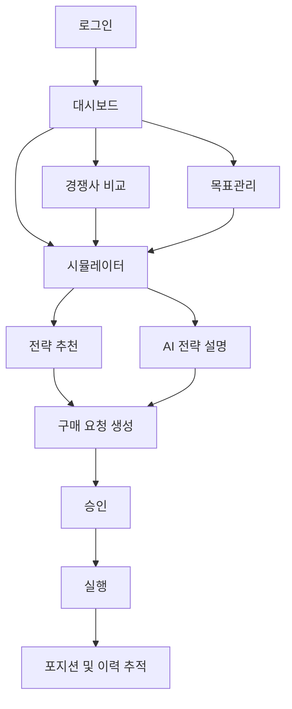

# Be-REAL Carbon Decision OS 사용자 흐름 문서

## 1. 문서 목적

이 문서는 Be-REAL Carbon Decision OS에서 사용자가 어떤 순서로 제품을 사용하고, 각 단계에서 무엇을 확인하고, 어떤 액션을 취하게 되는지를 정리한 문서이다.

문서 목적은 다음과 같다.

- 제품의 핵심 사용자 흐름을 명확하게 시각화한다.
- 화면 단위가 아니라 실제 업무 흐름 기준으로 제품을 이해하게 한다.
- 개발, 기획, 발표 시 공통된 사용자 시나리오를 제공한다.
- 현재 구현된 흐름과 앞으로 확장할 흐름을 구분해 정리한다.

## 2. 핵심 사용자 흐름 한 줄 요약

Be-REAL의 핵심 사용자 흐름은 다음과 같다.

`로그인 -> 현재 탄소 리스크 진단 -> 경쟁사 및 시장 비교 -> 전략 시뮬레이션 -> 목표 정렬 확인 -> 구매 요청 생성 -> 승인 -> 실행 추적`

이 문서에서는 이 흐름을 기준으로 세부 시나리오를 설명한다.

## 3. 사용자 역할

현재 및 향후 기준으로 제품에는 아래 역할이 존재할 수 있다.

- 실무 사용자
- 분석 사용자
- 요청 생성자
- 승인자
- 관리자

현재 구현 기준으로는 역할 구분이 명확히 드러나지 않지만, 향후 사용자 흐름에서는 역할에 따라 액션이 달라진다.

## 4. 주요 사용자 시나리오

## 4.1 시나리오 A: 첫 진입 및 현재 상태 파악

### 목적

- 사용자가 서비스에 로그인한 뒤, 자기 회사의 현재 탄소 상태를 빠르게 파악하는 흐름

### 사용자

- ESG 담당자
- 지속가능경영팀
- 재무 담당자

### 시작 조건

- 사용자가 계정을 가지고 있다.
- 회사 데이터가 시스템에 존재한다.

### 흐름

1. 사용자가 로그인한다.
2. 시스템은 인증 상태를 확인하고 메인 화면으로 이동시킨다.
3. 사용자는 대시보드에서 현재 회사의 배출량, 집약도, 주요 KPI를 확인한다.
4. 사용자는 Scope 구성과 연도별 추이를 본다.
5. 사용자는 현재 상태가 양호한지, 추가 검토가 필요한지 판단한다.

### 주요 화면

- 로그인
- 웰컴 화면
- Dashboard

### 사용자 질문

- 현재 우리 회사 배출량은 어느 수준인가?
- 작년 대비 개선됐는가?
- 지금 가장 먼저 봐야 할 리스크는 무엇인가?

### 시스템 응답

- KPI 카드
- Scope별 배출 구성
- 추이 차트
- 탭 이동 유도

### 현재 구현 상태

- 구현됨

### 향후 개선

- 대시보드에서 바로 “다음 액션 추천” 제안
- 최근 요청 상태 요약 표시

## 4.2 시나리오 B: 경쟁사와의 위치 비교

### 목적

- 사용자가 자사의 상대적 위치를 파악하고, 전략적 개선 필요성을 확인하는 흐름

### 사용자

- ESG 전략 담당자
- 경영기획 담당자

### 시작 조건

- 사용자가 대시보드에서 추가 분석 필요성을 인지했다.

### 흐름

1. 사용자가 Compare 탭으로 이동한다.
2. 탄소 집약도 또는 에너지 집약도 모드를 선택한다.
3. Scope 반영 범위를 조정한다.
4. 경쟁사 랭킹과 업계 기준선을 확인한다.
5. AI 인사이트를 통해 현재 위치를 해석한다.
6. 더 구체적인 액션 검토를 위해 시뮬레이터로 이동한다.

### 주요 화면

- Compare

### 사용자 질문

- 우리 회사는 경쟁사 대비 어느 수준인가?
- 평균보다 나은가?
- 상위 10% 진입을 위해 어느 정도 개선이 필요한가?

### 시스템 응답

- 경쟁사 순위 카드
- 비교 차트
- 업계 중앙값 / 상위 10% 기준선
- AI 해석 텍스트

### 현재 구현 상태

- 구현됨

### 향후 개선

- 비교 결과에서 바로 전략 제안 연결
- 업종 및 연도 필터 강화

## 4.3 시나리오 C: 전략 시뮬레이션과 예산 검토

### 목적

- 사용자가 다양한 조건을 반영해 탄소 조달 전략을 비교하는 흐름

### 사용자

- ESG 담당자
- 재무팀
- 구매 검토 담당자

### 시작 조건

- 사용자가 현재 리스크와 상대적 위치를 파악했다.

### 흐름

1. 사용자가 Simulator 탭으로 이동한다.
2. 현재 탄소 가격 추이를 확인한다.
3. 가격, 배출량 변화율, 무상할당, 예산 등을 입력한다.
4. 분할매수 여부나 경매 비율을 조정한다.
5. 시스템은 통합 비용, 예산 영향, 위험도를 계산해 보여준다.
6. 사용자는 여러 가정을 바꾸며 결과를 비교한다.

### 주요 화면

- Simulator

### 사용자 질문

- 지금 가격 수준에서 매수하는 것이 유리한가?
- 배출량이 늘어나면 예산 영향은 얼마나 커지는가?
- 해외 노출까지 포함하면 총 비용은 얼마인가?
- 분할 매수와 즉시 매수 중 어느 쪽이 더 안정적인가?

### 시스템 응답

- 시장 가격 차트
- 시뮬레이션 입력 패널
- 비용/리스크 요약
- 예산 안전 여부

### 현재 구현 상태

- 계산 기능 구현됨
- 추천 전략 기능은 아직 없음

### 향후 개선

- 추천 전략 카드 추가
- 전략별 비교 UI 추가
- 구매 요청 생성 버튼 추가

## 4.4 시나리오 D: 장기 목표와의 정렬 확인

### 목적

- 사용자가 단기 전략이 장기 감축 목표와 얼마나 정렬되는지 확인하는 흐름

### 사용자

- ESG 전략 담당자
- 경영진 보고 준비 사용자

### 시작 조건

- 사용자가 단기 조달 시나리오를 검토 중이다.

### 흐름

1. 사용자가 Targets 탭으로 이동한다.
2. 기준연도와 최신 배출량을 비교한다.
3. 현재 감축률을 확인한다.
4. SBTi 달성 여부와 Net Zero 격차를 확인한다.
5. 회귀 예측과 2030 달성 확률을 본다.
6. 시뮬레이션에서 고려한 전략이 장기 방향성과 충돌하지 않는지 점검한다.

### 주요 화면

- Targets

### 사용자 질문

- 지금 감축 속도는 충분한가?
- 현재 전략은 목표 달성에 도움이 되는가?
- 단기 비용 절감이 장기 목표 달성률을 해치고 있지는 않은가?

### 시스템 응답

- 기준 대비 최신 성과
- SBTi 판정
- Net Zero 격차
- 2030 달성 확률

### 현재 구현 상태

- 구현됨

### 향후 개선

- 전략별 목표 정렬도 표시
- 목표 기반 추천 문구 추가

## 4.5 시나리오 E: AI를 통한 해석 보조

### 목적

- 사용자가 수치와 전략을 자연어로 이해하는 흐름

### 사용자

- 실무 사용자
- 경영진 보고 준비 사용자

### 시작 조건

- 사용자가 숫자만으로 판단하기 어려운 상태다.

### 흐름

1. 사용자가 챗봇을 연다.
2. 현재 시장, 전략, 감축 목표 등에 대해 질문한다.
3. 시스템은 회사 맥락과 대화 이력을 반영해 답변한다.
4. 사용자는 전략 설명이나 의사결정 포인트를 이해한다.

### 주요 화면

- ChatBot

### 사용자 질문

- 지금 어떤 전략이 적절한가?
- 현재 시장 상황에서 리스크는 무엇인가?
- 경영진에게 어떻게 설명하면 되는가?

### 시스템 응답

- 스트리밍 텍스트 답변
- 맥락 기반 설명

### 현재 구현 상태

- 구현됨

### 향후 개선

- 시뮬레이터 추천 전략과 직접 연결
- 구매 요청 문안 자동 생성
- 보고용 요약 생성

## 4.6 시나리오 F: 구매 요청 생성

### 목적

- 사용자가 분석 결과를 실제 실행 가능한 요청으로 전환하는 흐름

### 사용자

- 요청 생성자
- 실무 담당자

### 시작 조건

- 사용자가 시뮬레이션 결과와 전략안을 검토했다.

### 흐름

1. 사용자가 추천 전략 또는 시뮬레이션 결과를 선택한다.
2. 시스템은 구매 요청 초안을 생성할 수 있게 한다.
3. 사용자는 제목, 설명, 시장, 볼륨, 예상 비용 등을 확인하거나 수정한다.
4. 요청을 저장하거나 제출한다.

### 주요 화면

- 향후 Purchase Request 생성 화면

### 사용자 질문

- 어떤 전략을 실행 요청으로 올릴 것인가?
- 요청 제목과 사유는 어떻게 써야 하는가?
- 예산과 리스크 정보가 충분히 담겼는가?

### 시스템 응답

- 요청 초안 폼
- 전략 요약
- 비용/리스크 요약

### 현재 구현 상태

- 미구현

### 향후 우선순위

- 매우 높음

## 4.7 시나리오 G: 승인 흐름

### 목적

- 승인자가 요청의 타당성을 검토하고 승인 또는 반려하는 흐름

### 사용자

- 승인자
- 관리자

### 시작 조건

- 구매 요청이 제출된 상태다.

### 흐름

1. 승인자가 요청 목록에서 대기 중 요청을 확인한다.
2. 요청 상세에서 전략, 비용, 리스크, 사유를 검토한다.
3. 승인 또는 반려를 선택한다.
4. 코멘트를 남긴다.
5. 시스템은 상태와 이력을 업데이트한다.

### 주요 화면

- 향후 Purchase Request List
- 향후 Purchase Request Detail

### 사용자 질문

- 이 요청은 예산 범위 내인가?
- 전략 근거가 충분한가?
- 지금 승인해도 되는가?

### 시스템 응답

- 요청 상세 정보
- 승인/반려 액션
- 상태 이력

### 현재 구현 상태

- 미구현

### 향후 우선순위

- 매우 높음

## 4.8 시나리오 H: 실행 및 이력 추적

### 목적

- 승인된 요청이 실행되었는지 추적하고, 이후 상태를 관리하는 흐름

### 사용자

- 실행 담당자
- 관리자
- 재무/리스크 담당자

### 시작 조건

- 구매 요청이 승인되었다.

### 흐름

1. 승인된 요청이 실행 대기 상태로 전환된다.
2. 실행 담당자는 실제 주문 또는 내부 실행 처리를 진행한다.
3. 시스템은 주문 또는 실행 상태를 기록한다.
4. 사용자는 요청과 주문 이력을 통해 결과를 확인한다.
5. 이후 포지션 또는 확보 물량을 조회한다.

### 주요 화면

- 향후 Order / Position 화면

### 사용자 질문

- 이 요청은 실제로 실행되었는가?
- 얼마에 체결되었는가?
- 현재 확보 물량은 얼마나 되는가?

### 시스템 응답

- 실행 상태
- 체결 정보
- 포지션 요약

### 현재 구현 상태

- 미구현

### 향후 우선순위

- 중간

## 5. 현재 제품 기준 실제 사용자 흐름

현재 코드베이스 기준으로 실제 가능한 흐름은 아래와 같다.

현재는 분석과 해석까지는 자연스럽게 이어지지만, 그 다음 단계인 `구매 요청`, `승인`, `실행`이 비어 있다.

## 6. 목표 사용자 흐름

앞으로 제품이 지향해야 하는 흐름은 아래와 같다.

## 7. 사용자 흐름별 핵심 전환점

제품 완성도를 가장 크게 올리는 전환점은 아래 3개다.

### 전환점 1. 시뮬레이션에서 추천 전략으로

- 계산 결과를 사람이 선택 가능한 전략안으로 바꾼다.

### 전환점 2. 추천 전략에서 구매 요청으로

- 분석 결과가 실행 가능한 액션으로 전환된다.

### 전환점 3. 구매 요청에서 승인/실행으로

- 제품이 실제 업무 시스템처럼 작동하기 시작한다.

## 8. 사용자 경험 상의 핵심 원칙

- 사용자는 숫자만 보고 끝나지 않아야 한다.
- 각 단계마다 “다음에 무엇을 해야 하는지”가 보여야 한다.
- 분석 결과는 전략으로, 전략은 요청으로 자연스럽게 이어져야 한다.
- 승인자 입장에서도 이해 가능한 수준의 설명과 이력이 제공되어야 한다.
- AI는 보조 기능이 아니라 이해와 설득을 돕는 역할이어야 한다.

## 9. 우선 설계가 필요한 사용자 흐름

다음 사용자 흐름은 현재 미구현이며, 가장 먼저 구체화해야 한다.

- 전략 추천 흐름
- 구매 요청 생성 흐름
- 승인 흐름

이 세 흐름만 추가되어도 제품은 단순 시뮬레이션 툴에서 실제 의사결정 지원 시스템으로 크게 발전한다.

## 10. 다음 작업 제안

이 문서 다음으로 가장 유용한 작업은 아래 두 가지다.

1. 구매 요청 생성 화면 와이어프레임 문서 작성
2. `DB_SCHEMA_NEXT.md` 작성

특히 지금 단계에서는 도메인과 API는 이미 정리되어 있으므로, 다음은 화면 흐름과 DB 구조를 맞추는 작업이 가장 효과적이다.
